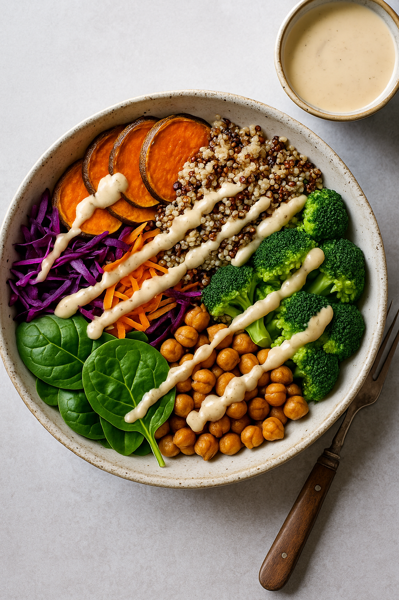

## 🥗 Buddha Bowl mit Tahini-Dressing

_Ein moderner Klassiker voller Balance und pflanzlicher Energie._

  

    

      
    

    

      <h3>Zutaten (für 2 Portionen)</h3>
      <ul>
        <li>150 g Quinoa</li>
        <li>½ große Süßkartoffel</li>
        <li>1 Avocado</li>
        <li>100 g Kichererbsen, gekocht</li>
        <li>1 EL Tahini (Sesampaste)</li>
        <li>Saft einer ½ Zitrone</li>
        <li>1 TL Ahornsirup</li>
        <li>Salz, Pfeffer, Olivenöl</li>
      </ul>
    

  

### Zubereitung

**Quinoa vorbereiten.** Quinoa in einem feinen Sieb kalt abspülen, um Bitterstoffe zu entfernen. In der doppelten Menge leicht gesalzenem Wasser bei kleiner Hitze ca. 15 Minuten sanft köcheln, bis die Körner glasig werden und kleine „Spiralen“ sichtbar sind. Vom Herd nehmen und zugedeckt 5 Minuten quellen lassen, mit einer Gabel auflockern.

**Süßkartoffeln rösten.** Süßkartoffel in 1,5 cm Würfel schneiden, mit 1–2 EL Olivenöl, Salz und Pfeffer mischen. Auf ein mit Backpapier belegtes Blech geben und im vorgeheizten Ofen 20–25 Minuten rösten, bis die Würfel außen leicht karamellisieren und innen weich sind.

**Tahini-Dressing.** Tahini mit Zitronensaft, Ahornsirup, 1 Prise Salz und 3 EL Wasser glatt rühren, bis eine cremig-fließende Konsistenz entsteht. Mit weiterem Wasser auf Wunsch verdünnen; mit Salz/Zitrone feinjustieren.

**Anrichten.** Quinoa als Basis in zwei Schalen geben. Geröstete Süßkartoffeln, Kichererbsen und Avocado darauf verteilen. Mit dem Tahini-Dressing beträufeln, frisch gemahlenen Pfeffer darüber.

💡 **TMC-Tipp:** 1 TL geröstetes Sesamöl gibt Tiefe; Granatapfelkerne für Frische. Für Crunch: kurz trocken geröstete Sesamsamen.

